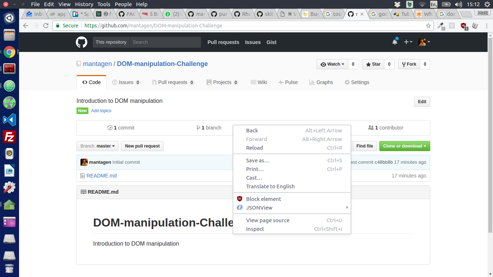
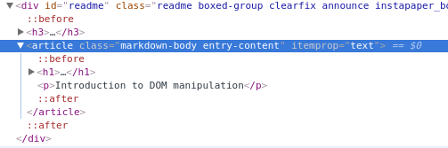

# DOM-manipulation-Challenge
Introduction to DOM manipulation

## What is the DOM?

The DOM is the _Document Object Model_, it is the browser's interpretation of the page once it has been [_parsed_](https://developer.mozilla.org/en-US/docs/Glossary/Parse).

## DOM elements

In your browser, if you _right-click_ on a page, you see _inspect element_.

In the image below, `article` is a DOM element.


Any html elements you write will be DOM elements in the browser, for example: `div`, `span`, `input`, `section`, etc etc.

## Accessing DOM elements using Javascript

You can access DOM elements with javascript.

`document.getElementById("myId")` returns the element with ID "myId";
```
<article id="featured-article">
  Lorem ipsum...
</article>
<script>
  var featuredArticleElement = document.getElementById(#featured-article);
  // <article id="featured-article">...</article>
</script>
```

`document.getElementsByClassName("myClass")` returns an [_array-like object_](http://www.nfriedly.com/techblog/2009/06/advanced-javascript-objects-arrays-and-array-like-objects/) of all elements with the class "myClass";

```
<li class="menu-item">
  London
</li>
<li class="menu-item">
  Nazareth
</li>
<script>
  var menuItems = document.getElementsByClassName("menu-item");
  // [_li.menu-item_,_li.menu-item_]
</script>
```

`document.querySelector(myCssSelector)` returns the first element matching `myCssSelector`, where `myCssSelector` takes the form of a [CSS selector](https://developer.mozilla.org/en-US/docs/Web/CSS/CSS_Selectors) for example "#myId", ".myClass", "myTag", etc etc.
```
<li class="menu-item">
  London
</li>
<li class="menu-item">
  Nazareth
</li>
<script>
  var firstMenuItem = document.querySelector(".menu-item");
  // <li class="menu-item">London</li>
</script>
```
`document.querySelectorAll(myCssSelector)` returns an _array-like object_ of all elements matching myCssSelector.
```
<li class="menu-item">
  London
</li>
<li class="menu-item">
  Nazareth
</li>
<script>
  var firstMenuItem = document.querySelectorAll(".menu-item");
  // [_li.menu-item_,_li.menu-item_];
</script>
```

## DOM element properties

## DOM element methods
